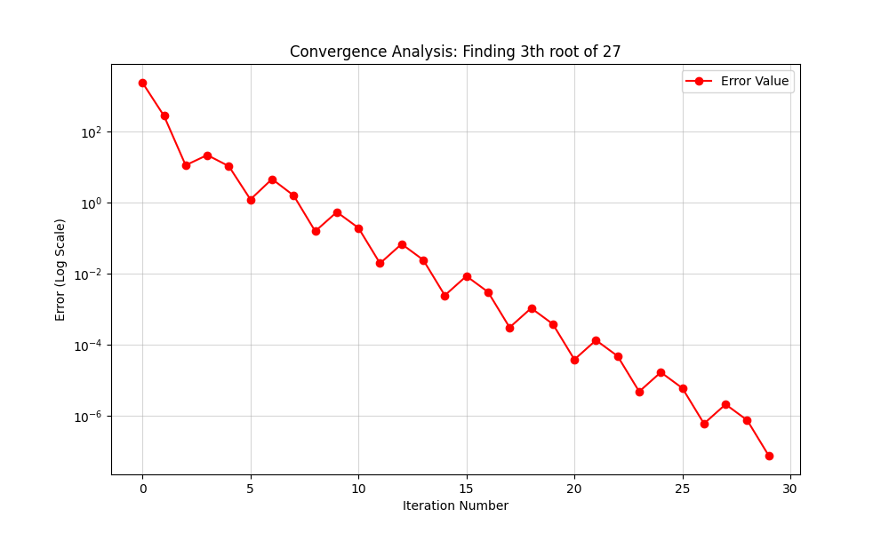

# 🧮 Bisection Method Root Finder

This project is a part of my **Scientific Computing** learning journey. It implements the Bisection Method to find the n-th root of any positive number, combined with data visualization to analyze the algorithm's performance.

## 🎯 Project Purpose
The goal was to move beyond basic calculations and understand the **convergence logic** of optimization algorithms. I've implemented the core mathematical logic and added a visualization layer to see how "error" behaves during the process.

## 📊 Visualizing the Logic
To make the algorithm's performance transparent and easier to understand, I used `matplotlib` to generate a **Convergence Plot**:

- **Error Tracking:** I modified the core function to record the error at every iteration.
- **Logarithmic Analysis:** By plotting the error on a logarithmic scale, we can clearly see the "Interval Halving" magic of the Bisection method. 
- **Efficiency:** The plot demonstrates how the algorithm reaches a precision of $10^{-7}$ in just about 30 steps.
<div align="center">

| 📉 Convergence Analysis Plot |
| :---: |
|  |
| *Logarithmic Error Decay* |

</div>
> *Note: While the core root-finding logic is the priority, I integrated data visualization tools to better represent the "Loss Curve" concept, which is fundamental in AI and Machine Learning.*


## 🛠 Features
- **Generic Root Finding:** Supports square root, cube root, and any n-th root calculation.
- **Validation:** Robust handling of edge cases like 0, 1, and error prevention for negative targets with even roots.
- **Auto-Save:** The convergence analysis plot is automatically saved as `convergence_plot.png` for easy documentation.

## 🚀 How to Run
1. Ensure you have `matplotlib` installed:
```bash
   pip install matplotlib
```
---
**Developed by Mohammad Sammiei**  
*Junior Developer & AI Student*

