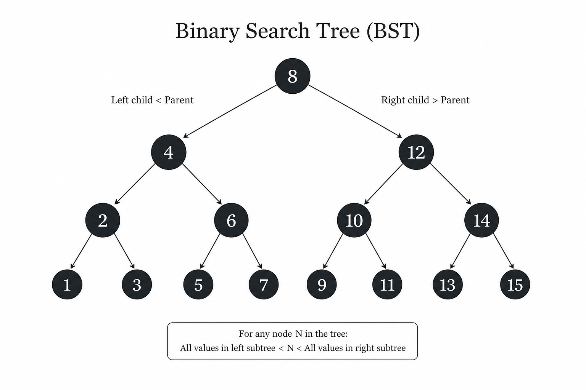

# Binary Search Tree (BST) Implementation in Python


A clean, modular, and fully-tested Python implementation of a Binary Search Tree (BST) with clean English comments.

<div align="center">
  <h3>Implementation Comparison & Visual Structure</h3>
  <table border="0" cellpadding="10">
    <tr>
      <td valign="middle">
        <!-- اینجا تصویر خود را قرار دهید -->
        
      </td>
      <td valign="middle">
        <table>
          <thead>
            <tr>
              <th>Feature</th>
              <th>Standard</th>
              <th>My Implementation</th>
            </tr>
          </thead>
          <tbody>
            <tr>
              <td>Architecture</td>
              <td>Script-based</td>
              <td>Modular (OOP)</td>
            </tr>
            <tr>
              <td>Testing</td>
              <td>Manual</td>
              <td>Automated (pytest)</td>
            </tr>
            <tr>
              <td>Deletion</td>
              <td>Basic</td>
              <td>Robust (successor handling)</td>
            </tr>
          </tbody>
        </table>
      </td>
    </tr>
  </table>
</div>

## Features
- **Core Operations**: Insert, Search, and Delete (handling leaf nodes, single-child, and two-children nodes with inorder successor replacement).
- **Properties**: Tree height calculation and node counting.
- **Traversals**: In-order tree traversal (`left -> root -> right`).
- **Visualization**: Rotated 90-degree text representation of the tree structure.
- **Testing**: Complete unit test suite using `pytest`.
## Implementation Comparison

| Feature | FCC / Standard Tutorial | My Implementation |
| :--- | :--- | :--- |
| **Architecture** | Script-based / Monolithic | Modular (Class-based, OOP) |
| **Testing** | Manual (print statements) | Automated (`pytest` suite) |
| **Documentation** | Minimal | Professional English Docstrings |
| **Deletion Logic** | Basic (or incomplete) | Robust (Successor/Predecessor handling) |
| **Extensibility** | Hard to maintain | Highly maintainable |

## Project Structure
```text
├── bst.py            # Main BST and TreeNode implementation
├── test_bst.py       # Unit tests covering all operations
└── README.md         # Project documentation
```

## Getting Started

### Prerequisites
Make sure you have Python 3.x installed. It is recommended to use a virtual environment (`venv`).

### Setup and Testing
1. Clone this repository or copy the files.
2. Install testing dependencies:
   ```bash
   pip install pytest
   ```
3. Run the test suite:
   ```bash
   pytest test_bst.py -v
   ```

## Example Usage
```python
from bst import BinarySearchTree

# Initialize tree
bst = BinarySearchTree()
nodes = [50, 30, 20, 40, 70, 60, 80]

# Insert nodes
for node in nodes:
    bst.insert(node)

# Display tree
print(bst.display())
```
