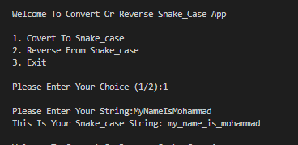
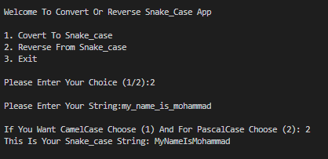

# 🐍 Python Case Converter & Reverser

A smart and efficient CLI tool designed to bridge the gap between different naming conventions in programming. This project is an enhanced and customized version of the CamelCase Converter project from **freeCodeCamp**, expanded with bidirectional conversion and intelligent detection.

## ✨ Key Features
- **Smart Auto-Detection:** Automatically identifies if a string is already in `snake_case` to prevent redundant processing.
- **Bi-directional Conversion:** 
  - **Pascal/Camel to Snake:** Converts `MyVariable` or `myVariable` to `my_variable`.
  - **Snake to CamelCase:** Converts `my_variable` to `myVariable`.
  - **Snake to PascalCase:** Converts `my_variable` to `MyVariable`.
- **Interactive CLI:** A user-friendly command-line interface with a persistent menu loop.
- **Optimized Logic:** Built using Pythonic principles like `List Comprehensions`, `split/join` methods, and efficient string manipulation.

## 🛠️ Usage
1. Ensure you have Python installed.
2. Clone this repository.
3. Run the script using:
```bash
   python main.py
   
## 📸 Screenshots

| Task 1: Convert to Snake Case | Task 2: Reverse Conversion |
|:---:|:---:|
|  |  |

## 🧠 Concepts Applied
In this project, I have implemented and mastered the following Python concepts:

- [x] **Advanced List Comprehensions**: Using conditional logic (`if/else`) inside lists for concise code.
- [x] **String Manipulation**: Expert use of methods like `.isupper()`, `.lower()`, `.title()`, `.split()`, and `.join()`.
- [x] **Control Flow**: Managing continuous execution and user exits using `while` loops and `break` statements.
- [x] **CLI Design**: Creating a user-friendly Command Line Interface with interactive inputs.
- [x] **Logic Building**: Developing an `auto_detection` system to identify string formats.

---
**Developed with 💻 by Mohammad Sammiei**
