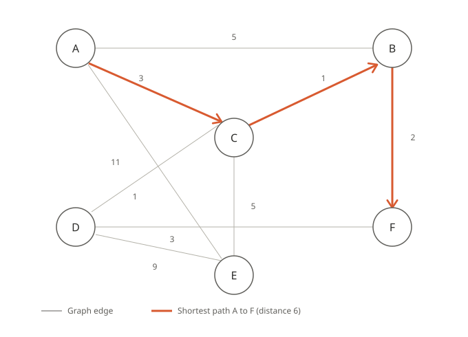

# Dijkstra's Shortest Path Algorithm

A simple, readable implementation of **Dijkstra's algorithm** in pure Python (no external libraries) for finding the shortest path between nodes in a weighted graph.

## 📊 Example Graph

<table>
<tr>
<td align="center">

<br/>
<sub><b>Figure 1.</b> The weighted graph defined in <code>my_graph</code>. The red path shows the shortest route from <code>A</code> to <code>F</code> (distance = 6), computed by the algorithm below.</sub>
</td>
</tr>
</table>

## ✨ Features

- Computes the shortest distance from a start node to every other node
- Reconstructs and displays the **actual path taken**, not just the final distance
- Supports limiting the output to a single target node
- No external dependencies — pure Python only

## 🧠 How the Algorithm Works

1. The graph is defined as a dictionary mapping each node to a list of `(neighbor, edge_weight)` pairs.
2. The start node's distance is set to zero, and all other nodes are initialized to infinity.
3. At each step, the closest unvisited node is selected and its neighbors are checked (the *relaxation* step).
4. If a shorter path to a neighbor is found, its distance and path are updated.
5. The processed node is removed from the unvisited list until the list is empty.

## ⏱️ Time Complexity

This implementation selects the next node with `min(unvisited, key=distances.get)`, which is a **linear scan** over the unvisited list rather than a priority queue. That gives:

- **Current implementation:** `O(V² + E)` — where `V` is the number of vertices and `E` is the number of edges.
- **Optimized version (with a binary heap / `heapq`):** `O((V + E) log V)`

For small graphs like the example above, the difference is negligible. For large graphs, replacing the linear scan with a min-heap (`heapq`) is the standard optimization and is recommended as a future improvement.

## 🚀 Usage

```python
def shortest_path(graph, start, target=None):
    ...

my_graph = {
    'A': [('B', 5), ('C', 3), ('E', 11)],
    'B': [('A', 5), ('C', 1), ('F', 2)],
    'C': [('A', 3), ('B', 1), ('D', 1), ('E', 5)],
    'D': [('C', 1), ('E', 9), ('F', 3)],
    'E': [('A', 11), ('C', 5), ('D', 9)],
    'F': [('B', 2), ('D', 3)]
}

# Compute the shortest path from A to F only
shortest_path(my_graph, 'A', target='F')

# Compute the shortest path from A to all nodes
shortest_path(my_graph, 'A')
```

### Parameters

| Parameter | Type | Default | Description |
|---|---|---|---|
| `graph` | `dict` | required | Graph dictionary in the form `{node: [(neighbor, weight), ...]}` |
| `start` | `str` | required | The starting node |
| `target` | `str \| None` | `None` | The target node. If `None`, distances and paths to **all** nodes are printed |

### Return Value

The function returns a tuple `(distances, paths)`:

- `distances` (`dict`): the shortest distance from `start` to each node
- `paths` (`dict`): the list of nodes forming the shortest path from `start` to each node

## 📄 Sample Output

Running `shortest_path(my_graph, 'A', target='F')` on the example graph above prints:

```
A-F distance: 6
Path: A -> C -> B -> F
```

This matches the highlighted path in Figure 1: **A → C → B → F**.

## 📦 Running the Project

No packages need to be installed — just make sure Python 3 is available:

```bash
python shortest_path.py
```

## 📄 License

This project is released under the MIT License. Feel free to use, modify, and distribute it.