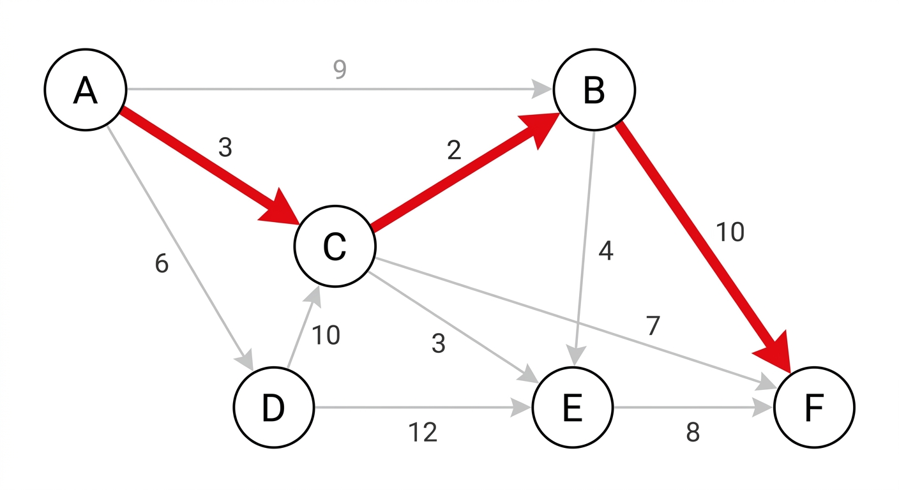

# Dijkstra's Shortest Path Algorithm

A simple, readable implementation of **Dijkstra's algorithm** in pure Python (no external libraries) for finding the shortest path between nodes in a weighted graph.

## 📊 Example Graph

The diagram below shows a sample weighted graph. The highlighted red path represents the shortest path found by the algorithm between two nodes:



## ✨ Features

- Computes the shortest distance from a start node to every other node
- Reconstructs and displays the **actual path taken**, not just the final distance
- Supports limiting the output to a single target node
- No external dependencies — pure Python only

## 🧠 How the Algorithm Works

1. The graph is defined as a dictionary mapping each node to a list of `(neighbor, edge_weight)` pairs.
2. The start node's distance is set to zero, and all other nodes are initialized to infinity.
3. At each step, the closest unvisited node is selected and its neighbors are checked (the *relaxation* step).
4. If a shorter path to a neighbor is found, its distance and path are updated.
5. The processed node is removed from the unvisited list until the list is empty.

## 🚀 Usage

```python
my_graph = {
    'A': [('B', 5), ('C', 3), ('E', 11)],
    'B': [('A', 5), ('C', 1), ('F', 2)],
    'C': [('A', 3), ('B', 1), ('D', 1), ('E', 5)],
    'D': [('C', 1), ('E', 9), ('F', 3)],
    'E': [('A', 11), ('C', 5), ('D', 9)],
    'F': [('B', 2), ('D', 3)]
}

# Compute the shortest path from A to F only
shortest_path(my_graph, 'A', 'F')

# Compute the shortest path from A to all nodes
shortest_path(my_graph, 'A')
```

### Parameters

| Parameter | Description |
|---|---|
| `graph` | Graph dictionary in the form `{node: [(neighbor, weight), ...]}` |
| `start` | The starting node |
| `target` | (Optional) The target node; if empty, distances to all nodes are printed |

### Return Value

The function returns a tuple of two dictionaries:

- `distances`: the shortest distance from the start node to each node
- `paths`: the list of nodes forming the shortest path to each node

## 📦 Running the Project

No packages need to be installed — just make sure Python 3 is available:

```bash
python shortest_path.py
```

## 📄 License

This project is released under the MIT License. Feel free to use, modify, and distribute it.