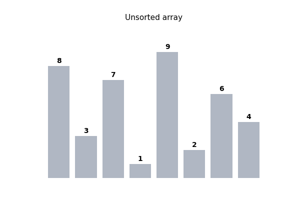

# Merge Sort Project (Enhanced Version)

## About

This project is based on the Merge Sort tutorial from **freeCodeCamp**. The original fCC version was a single file that only implemented the sorting algorithm. I took that version and turned it into a more complete, modular project.

## How It Works

<div align="center">
  <table>
    <tr>
      <!-- ستون سمت چپ: گیف آموزشی شما -->
      <td width="50%" align="center">
        
        <br>
        <em>نمای متحرک الگوریتم تقسیم و حل</em>
      </td>
      <!-- ستون سمت راست: راهنمای رنگ‌ها -->
      <td width="50%" valign="top">
        <h4>Legend & Guide</h4>
        <ul>
          <li>🟦 <b>Blue:</b> در حال ادغام (Merge)</li>
          <li>⬜ <b>Gray:</b> خارج از پردازش فعلی</li>
          <li>🟩 <b>Green:</b> مرتب‌شده نهایی</li>
        </ul>
        <hr>
        <p align="justify">
          <b>Logic:</b> این انیمیشن نشان می‌دهد که آرایه ابتدا به کوچکترین واحدها (تک عضوی) تقسیم شده و سپس به صورت مرتب‌شده با هم ترکیب می‌شوند.
        </p>
      </td>
    </tr>
  </table>
</div>


## Honest Disclosure About AI Assistance

This was the **first time** I modularized a project (i.e., splitting code into separate files with distinct responsibilities), and I didn't have much experience with it. To learn how to do this properly, I got help from AI (Claude):

- **Modular structure**: I learned how to separate the core logic (`merge_sort.py`), the user interface (`main.py`), and the tests (`test_merge_sort.py`) from each other.
- **Execution time measurement and comparison counting (`stats`)**: I copied this implementation based on AI guidance, then went through and understood why each line works (for example, why a dictionary is used for `stats` instead of a simple variable, due to scope issues in recursive functions).
- The core Merge Sort algorithm itself (the main divide-and-merge logic) I already knew and took directly from the freeCodeCamp tutorial; AI only helped with project structuring and the additional features.

## Comparison with the Original freeCodeCamp Version

| Feature | freeCodeCamp Version | My Version |
|---|---|---|
| File structure | Single file | Three separate files (logic, execution, tests) |
| Sort order | Ascending only | Ascending and descending (`reverse`) |
| Comparison counting | No | Yes (`stats`) |
| Execution timing | No | Yes (`time.perf_counter`) |
| Automated tests | No | 7 tests with `pytest` |
| User interface | Simple print in `__main__` | Interactive menu with user input |
| Stable sort | No (uses `<`) | Yes (uses `<=`) |

## Project Structure

```
├── test/
│   └── test_merge_sort.py   # Unit tests using pytest
├── main.py                  # CLI interactive interface
├── merge_sort.py            # Core Merge Sort implementation
├── .gitignore                # Files to ignore in Git (caches, etc.)
└── README.md                 # Project documentation
```

## How to Run

```bash
python main.py
```

## How to Run Tests

```bash
python -m pytest
```