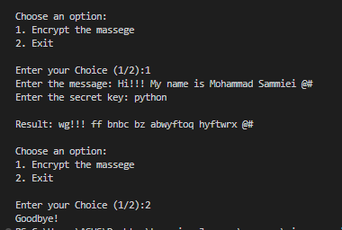

# 🔐 Vigenère Cipher Implementation

A robust and interactive Python tool for text encryption using the classic Vigenère Cipher algorithm. This project was developed as part of the *Scientific Computing with Python* curriculum to master string manipulation, loops, and modular arithmetic.

### 🌟 Key Features
- **Dynamic Key Rotation:** Automatically repeats the keyword to match the message length using the modulo operator.
- **Character Protection:** Intelligently skips spaces, numbers, and special symbols during encryption, keeping the message structure intact.
- **Interactive Interface:** Features a persistent command-line menu for a seamless user experience.
- **Automated Formatting:** Converts all input to lowercase to ensure consistency and prevent indexing errors.

### 🛠 Internal Logic
The encryption process follows this mathematical formula:

$$E_i = (P_i + K_i) \pmod{26}$$

**Where:**
- **$E_i$**: The index of the resulting encrypted letter.
- **$P_i$**: The index of the original plaintext letter in the alphabet.
- **$K_i$**: The index of the corresponding key letter.

### 📸 Terminal Preview
Below is a demonstration of the script in action:

## 📸 Terminal Preview

| 🔐 Vigenère Cipher Encryption Process |
|:---:|
|  |
### 🚀 Getting Started

**Prerequisites:**  
Python 3.x installed on your machine.

**Execution:**  
Navigate to the directory and run the script:
```bash
cd "courses/vigenere cipher"
python main.py
